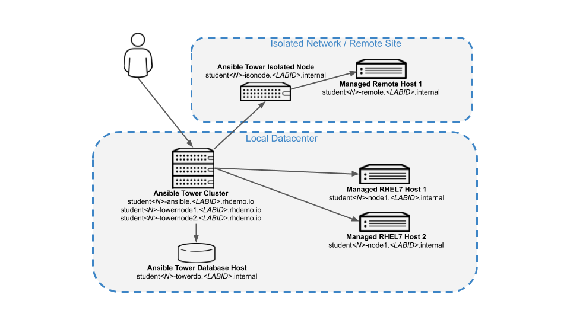

# Exercise 1 - Ansible Tower Advanced

## About this Lab

You have already used Ansible Automation quite a bit and have started to
look into Tower? Or you are already using Tower? Cool. We prepared this
lab to give a hands-on introduction to some of the more advanced
features of Tower. You’ll learn about:

  - Using command line tools to manage Ansible Tower

  - Ansible Tower clustering

  - Working with Instance Groups

  - Using isolated nodes to manage remote locations

  - Ways to provide inventories (importing inventory, dynamic inventory)

  - The Smart Inventory feature

  - Optional: How to structure Ansible content in Git repos

  - Optional: How to work with the Tower API

## So little time and so much to do…

> **Warning**
>
> To be honest we got carried away slightly while trying to press all
> these cool features into a two-hours lab session. We decided to flag
> the last two chapters as "optional" instead of taking them out. If you
> find the time to run them, cool\! If not, the lab guide will stay
> where it is, feel free to go through these lab tasks later (you don’t
> need a Tower cluster for this).

## Want to Use this Lab after Summit?

Definitely, the Asciidoc sources are available here:

**https://github.com/goetzrieger/ansible-labs/blob/master/tower/ansible\_tower\_advanced.adoc**

# Your Ansible Tower Lab Environment

In this lab you work in a pre-configured lab environment. You will have
access to the following hosts:

|                                  |                                         |                                |
| -------------------------------- | --------------------------------------- | ------------------------------ |
| Role                             | Hostname External (if applicable)       | Hostname Internal              |
| Ansible Tower Cluster            | student\<N>.ansible.\<LABID>.rhdemo.io                                        |                                |
| Ansible Tower Database Host      |                                         | towerdb.example.com            |
| Managed RHEL7 Host 1             |                                         | support1.&lt;GUID&gt;.internal     |
| Managed RHEL7 Host 2             |                                         | support1.&lt;GUID&gt;.internal     |
| Ansible Tower Isolated Node      |                                         | worker1.emea.internal |
| Managed Remote Host 1            |                                         | isosupport1.internal  |

> **Tip**
>
> The lab environments in this session have a **\<LABID>** and are separated by numbered **student\<N>** accounts. You will be able to SSH into the hosts using the external hostnames. Internally the hosts have another DNS name.

> **Tip**
>
> Ansible Tower has already been installed and licensed for you, the web
> UI will be reachable over HTTP/HTTPS.

As you can see the lab environment is pretty extensive. You basically
have:

  - A three-node Tower cluster with a separate DB host, accessed via SSH
    or web UI

  - Two managed RHEL 7 hosts

And a to mimic a remote side:

  - One host that acts as an isolated Tower node that can be reached via
    SSH from the Tower cluster nodes.

  - One host which acts as a remote managed node that can only be reached
    from/through the isolated node.

A diagram says more then a thousand words:

> **Tip**
>
> Access to the isolated node and the managed hosts is actually not
> restricted in the lab environment. Just imagine filtered, DMZ-like
> access rules for educational purposes… ;-)

## Working the Lab

Some hints to get you started:

  - Don’t type everything manually, use copy & paste from the browser
    when appropriate. But don’t stop to think and understand… ;-)

  - To edit files or conveniently open a terminal window, we provide **code-server**, basically the great VSCode Editor running in your browser. It's running on the first Tower node and can be accessed through the URL **student\<N>-code.\<LABID>.rhdemo.io**

> **Tip**
>
> Commands you are supposed to run are shown with or without the
> expected output, whatever makes more sense in the context.

> **Tip**
>
> The command line can wrap on the HTML page from time to time. Therefor
> the output is often separated from the command line for better
> readability by an empty line. **Anyway, the line you should actually
> run should be recognizable by the prompt.** :-)
